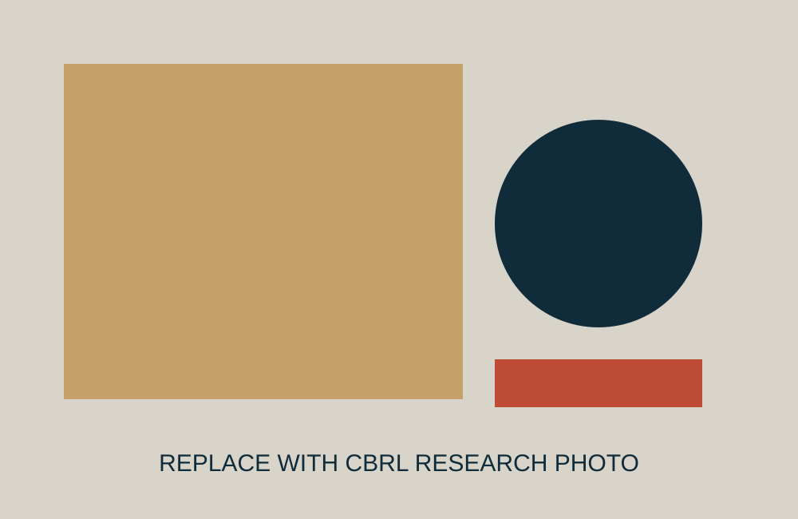

::: {.hero .column-screen}
::: {.hero-shade}
::: {.hero-copy}

## New dimensions of comic book value

CBRL applies scientific methods to understand, preserve, and extend the life of comic books.

[OUR RESEARCH](research.qmd){.btn .btn-primary} [OUR SERVICES](services.qmd){.btn .btn-outline}
:::

::: {.hero-card}
**COLLECTION DECISIONS** 
Helping you make informed choices about acquisition, storage, and care.

**DATA-DRIVEN CONDITION ASSESSMENT**
Helping us all understand measurable properties beyond visible appearance.

**DATA-DRIVEN APPRAISALS WITH NO CONFLICT OF INTEREST** 
Appraising current and predicted condition of valuable comics.

**SCIENTIFIC DISCOVERY** 
Advanced, data-driven causal modeling of how comic books age and deteriorate.

:::
:::
:::

::: {.three-up}
::: {.pillar}

01

## Understand
**MEASURE MATERIAL CHANGE**

We quantify physical and chemical properties using imaging, chemical analysis, and mechanical measurements.
:::
::: {.pillar}

02

## Predict
**LINK EXPOSURE TO OUTCOMES**

We study how environmental conditions and interventions relate to material change and future trajectories.
:::
::: {.pillar}

03

## Preserve
**INFORM BETTER CARE**

We translate measurement and research into useful information for collectors, researchers, and institutions.
:::
:::

::: {.feature-grid}
::: {.feature-image}
{fig-alt="Replace with a CBRL laboratory research photograph"}
:::
::: {.feature-copy}
FEATURED RESEARCH
## From Pages to Possibilities

We combine imaging, chemical analysis, and mechanical measurements to investigate how and why comics age.

[LEARN MORE](research.qmd){.btn .btn-primary}

*Replace this image and caption with an actual CBRL research artifact or measurement workflow.*
:::
:::

## Our Work Covers {.section-title}

::: {.work-grid}
::: {.work-card}

### Color & Spectral Analysis
Quantifying visual and spectral change.
:::
::: {.work-card}

### Paper Structure
Fibers, coatings, defects, and deformation.
:::
::: {.work-card}

### Chemical Properties
pH and other indicators of material state.
:::
::: {.work-card}

### Mechanical Integrity
Stiffness, flexibility, and material degradation.
:::
:::

::: {.closing-band}
::: {.closing-copy}
## A Shared Commitment
Comics connect people, ideas, and eras. CBRL works at the intersection of science and culture to help understand and preserve these physical artifacts.
:::
::: {.closing-mark}
**MEASURE**  
**UNDERSTAND**  
**PRESERVE**
:::
:::
